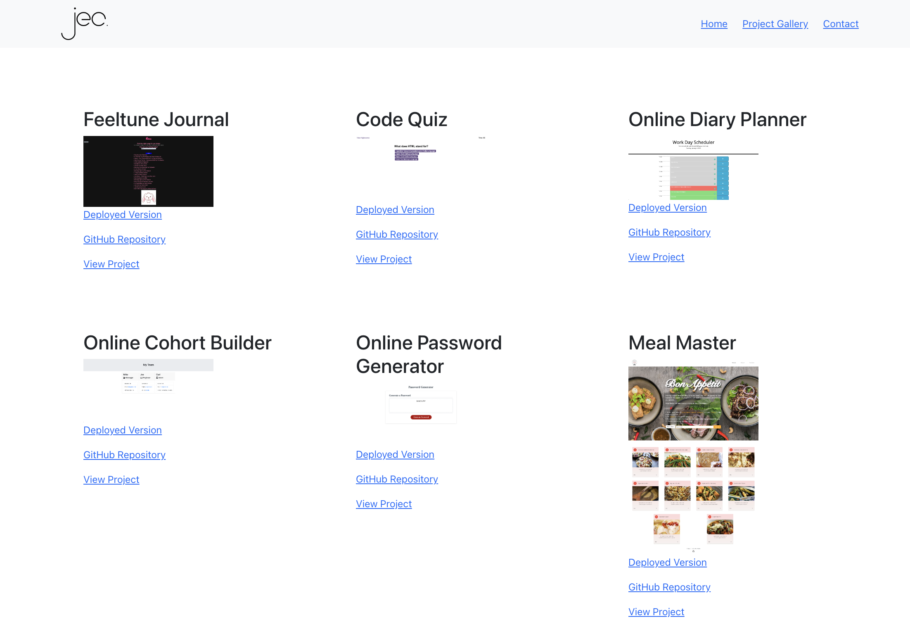

# <h1 align="center">**✨ Josh.C's Portfolio ✨**</h1>

## 📝 **Description**
This is my own Dev portfolio built using primarily React.js. This project allowed me to practice building dynamic applications through React components and using Node packages to handle extra dependencies.

## **Demo**

## 🗂️ **Table of Contents**
1. [Installation](#installation)
2. [Usage](#usage)
3. [License](#license)
4. [Questions](#questions)

## 💻 **Installation** 
Fork and clone the repository and open the project. Install all required dependencies by running `npm install`

## 🚀 **Usage** 
First, `fork` the repository into your personal GitHub workspace and `clone` the project — this is so that you have your own personal copy of the application. Open the application to explore the project files if you wish. To view the portfolio. install all required dependencies by running `npm install` in a terminal. Once successful, run `npm start`.

## 🪪 **License** 
 — (<Project-Title> is covered under MIT License.)

## ❔ **Questions** 
Any queries about this project, please feel welcome to reach out to me using the following credentials:
<h3>Josh Capito</h3>
- Github: <a href="https://github.com/jemcap">Josh Capito</a>
 
- Email: <a href="mailto:joshuaecapito22@gmail.com">joshuaecapito22@gmail.com</a>
